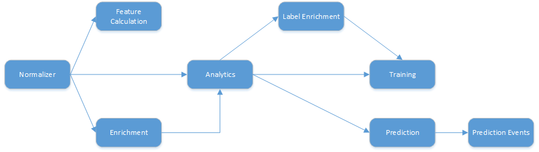
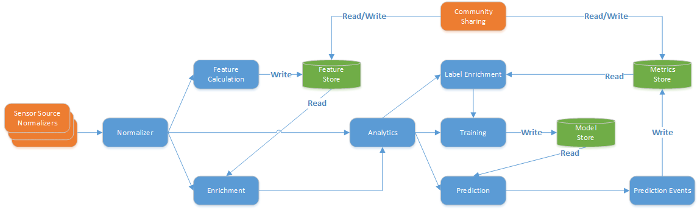
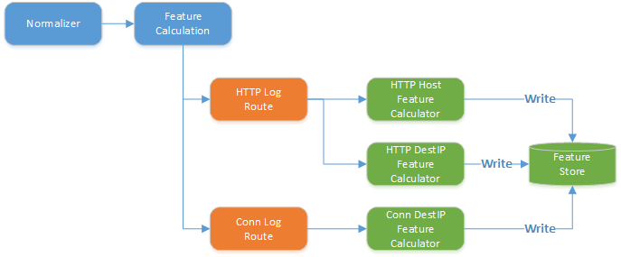
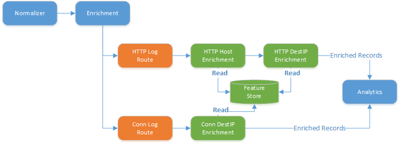
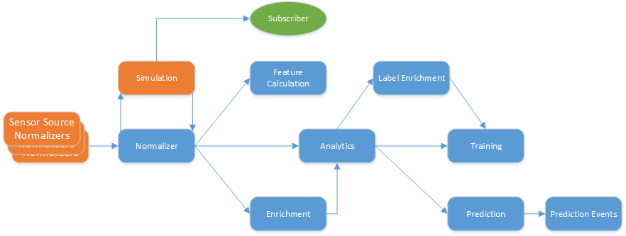

# Overview

CLAP Standard DAG Model

# Standard DAG Model

The Standard DAG Model is an implementation approach in the cyber-stream-processing framework that:

- Standardizes the flow of log data into stages
- Standardizes the stages within the flow for intent
- Standardizes the persistable data to enable variable implementations

The DAG stages are wrapped into a single streaming executable module with consistent start/stop semantics.
The stages of the DAG are similar to the stages in a SIEM/SOAR system to enable integration with such systems.
The stagest of the DAG are depicted below.

The interconnection of the stages provides for the "high-level flow" of data, routing from Normalization through to eventual Prediction Events.

Within each stage, multiple compute entities (called processors) are used, with data routed to each processor by data type.
The flow of data through the DAG is indeed facilitiated by using standardized data types passed as Dictionaries (Processing Entities) each with an "EntityTypeId" (UUID) that identifies the standard data type contained in the record.

Most stages have need to read and/or write some data types generated or used by a processor. This includes the need for feature storage, metric (label) storage, etc. When the DAG is viewed with these items in place the graphic is as follows.

Of note is the community sharing tie-ins where interaction to and from external entities is facilitiated. These interactions are a key part that makes this framework unique. The integration of a single data element, such as a "maliciousness label" for a single host from multiple community reports is an implicit capability of the store APIs in use and the integration model is designed to permit the addition of more data types by injecting new libraries at startup of a deployment.

# Normalization

Normalization is where data is fed into the DAG, with the expectation that each record conforms to the Normal specifications for each log data type.
The inputs to Normalization are generally expected to be an aggregate of all log types, where traffic is then routed by type to other stages.

Any sources of data will have some number of components prior to the normalizer that are responsible for sourcing the data and normaliing it to a specified log data type, such as HTTPLog, ConnLog, SSLLog, SSHLog, FileLog, etc.

The prior graphic depicts an example of sourcing HTTP log data from local files to log specific normalizing processors for Zeek formatted HTTP and Conn logs, which then writed togehter as a merged stream to the Normalizer.  Additionally, there is an Apache HTTPD log appender that receives log records from an Apache server, which then normalizes as well to the standard HTTPLog output, again streaming to the Normalizer. Note that the output from the Normalizer to the later stages of the DAG in the depicted scenario will include both HTTPLog and ConnLog messages.

The Normalizer implementation will support buffering to ensure in-order delivery by log timestamp to later processors. If in-order messages are already guaranteed by the sources without conflict, buffering in the Normalizer can be disabled to gain additional efficiency.

All log types and sources, once normalized will write into the common Normalizer which then routes data forward to other stages.

Data output from Normalization are routed to:

- Feature Calculation
- Enrichment
- Analytics

# Feature Calculation

Feature Calculation is the stage in which aggregate fields are computed from raw log entries based upon a common key field, such as the host field for HTTPLog entries.  Feature Calculation is implicitly "batched" in that features are aggregated for a period of time, then a set of features are posted that convey the aggregated results over that time period. Standard Feature Calculation processes are currently specified to output features aggregated over a 24-hour period batched every 30-minutes. The Enrichment stage will utilize the features output from the Feature Calculation stage for the prior batch period.  This mechanism ensures that a streaming or batch approach will see the same enrichment process given the same stream of input data.

The storage of features is handled by a Feature Store, which is written to by Feature Calculation processors and read from by Enrichment Processors.

# Enrichment

Enrichment is the process of adding additional data fields to an existing record. In this stage of the DAG, features from the Feature Calculation stage are used to enrich the log data. This enrichment happens in a single pass, in that if a data type requires multiple enrichments (for example enriching an HTTPLog with HTTPHostFeature and HTTPDestIPFeature), the use of a Processing Chain is required. This chain creates a sequence of processing steps, the output of each step becomes the input of the next step. The final output from the last step of the chain creates the final enriched output for that log type.

In the above graphic, Enrichment is shown with routes such that HTTPLog records are routed to the chain of an HTTPHostEnrichmentProcessor and HTTPDestIPProcessor, whereas ConnLog records are routed to a single ConnDestIpEnrichmentProcessor. The output of both are then routed to the Analytics stage.

# Analytics

The Analytics stage is a "super stage" that encapsulates labelling, training and prediction. For any analytics that do not have separate training and prediction steps, they should route directly to prediction only. For all analytics with a distinct training and prediction phase (such as a neural net), the training would be a distinct processor in the Training sub-stage and prediction would be a distinct processor in the Prediction sub-stage.

## Label Enrichment

Label Enrichment is a special case of Enrichment in which we are only attaching "labels", or in the case of this architecture, "Scores". A score is a measure of both "goodness" and "badness", each on an independent 0-1 scale.  Scores get "rolled up" across multiple community and local records to produce a single relative "sense" of how likely the "label target" is to be "good" (benign) or "bad" (malicious). In this case, the "label target" can be a defined record within a specific log type (e.g. for HTTPLog, host="www.badguys.com").

For a single log type, as with regular enrichment, multiple fields may be candidates for labeling and therefore a ProcessingChain may be used to ensure a final output has all labels attached, each with a unique name.

Example:

- HTTPLog entry -->  host, destip, sourceip, etc...
- HTTPHost feature --> host, x, y, z, etc...
- HTTPDestIp feature --> destip, p, q, r, etc...
- HTTPHostLabel --> host, hostgoodness, hostbadness
- HTTPDestIp feature --> destip, destipgoodness, destipbadness
- Fully labeled/enriched output
   + Type --> HTTPLog (generally the output type doesn't change from the input type, other than in feature calculation)
   + Fields --> host, destip, sourceip, x, y, z, p, q, r, hostgoodness, hostbadness, destipgoodness, destipbadness, etc...

Data can be routed to Label Enrichment from 2 distinct sources, each one treated separately as follows:
- Enrichment -enriched data
- Normalization -unenriched data

If a Label Enrichment can be done on either source, 2 distinct instances of the Label Enrichment Processor will be added, one for each pathway

## Training

Training is the most complex stage in that it can receive input from several distinct paths. Messages can be routed to training from:
- Normalization -unenriched, unlabeled data
- Enrichment -enriched, unlabeled data
- Label Enrichment VIA Enrichment -enriched, labeled data
- Label Enrichment VIA Normalization -unenriched, labeled data

For each type of Analytic that has a training processor, it should have a distinct instance for each pathway it trains upon.

## Prediction

The Prediction stage is where all analytics generate an output prediction Score for each input record. Prediction receives input either from Enrichment or from Normalization, just like Label Enrichment.

All outputs from Prediction, across all analytics are sent to Prediction Events. 

# Prediction Events

Prediction Events are the output records from Prediction, which are full records with a Score attached. The Prediction Events processors are defined for each data type (e.g. HTTPLog) to extract an output prediction score for the prediction processor producing the result. Note that for each Analtyic Processor, there will be a "copy" of the record with a unique output Score from that Processor. The Prediction Events processor is expected to deal with any additional handling from that perspective.

Prediction Events can be used to:
- Update the MetricStore Scores for a record (as a Label for use in Label Enrichment)
- Feed forward as Alerts to another system / appliance
- Route to any other external destination or storage device for retention

# Simulation Mode

When run in an ad hoc manner, the DAG has a time schedule based upon the time stamps of the log entries flowing through the Normalizer. The "clock" for all other processors and stores may need to be relative to the log data timestamps (e.g. to enable scores/labels to be relative in time to the log entry timestamps). This is accomplished by having a "simulation harness" that shims the DAG Normalizer.

In a simulation, the normalizer is "trapped" sending all records through a simulation processor prior to forwarding to the rest of the DAG. This simulation trap extracts the time stamps from the processing entities and forwards the timestamp to any "subscribers" which are simulation specific providers that are simulation clock aware. To ensure the timely arrival of timestamps to subscribers, the simluation clock provider is blocking until the timestamps have been forwarded.

