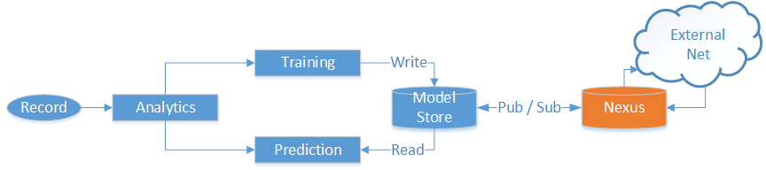
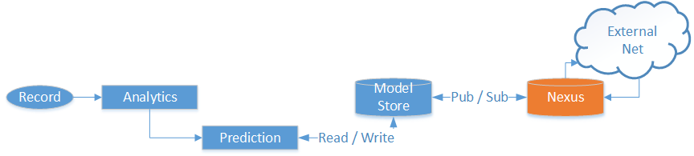
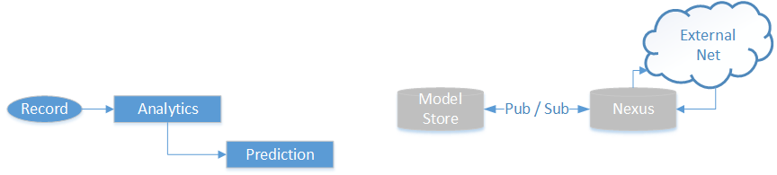
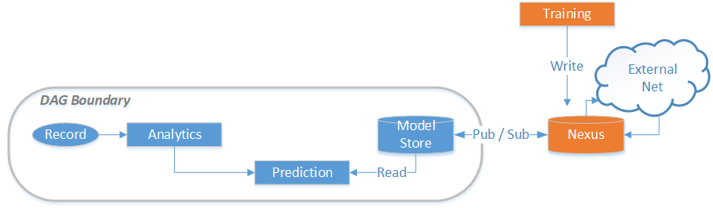

# Overview
The CLAP common DAG model treats analytics in two phases: Training and Prediction.

Any analytic is expected to potentially span both phases with a dedicated processor for each phase.  The Training phase receives all records and may use them however it requires to periodically publish a "model state" which is a representation of the state learned during some training period.  The Precition phase also receives all records and may read a published "model state" which would have been published by the Training processor.

# Analytics Stages and Flow

All data flows through the DAG based upon defined routes such that the DAG configuration determines which "entity type" records are sent to which processors, as defined in the [routing](routing.md) document.

## Training
Each Training processor can define the enrichment state of the data it receives. Training processors can receive data in any 1 of the following states:
- Raw / Unenriched: data arrives directly from the output of Normalization
- Enriched: data is enriched with any applicable features available
- Labelled: data is labelled with any applicable scores but without features
- Enriched and Labelled: data is first enriched, then labelled with any applicable scores

Note (in the graphic above) that training does not output results to any further processors. It is still expected that the training processors forward any model states to downstream connected processors which are primarily for tracing.

## Prediction
Each Prediction processor can define the enrichment state of the data it receives. Prediction processors can receive data in any 1 of the following states:
- Raw / Unenriched: data arrives directly from the output of Normalization
- Enriched: data is enriched with any applicable features available

Note (in the graphic above) that prediction does output results to the prediction events processors. It is therefore expected that the prediction processors forward all prediction outputs to downstream connected processors. Additionally, it should be recalled as defined in the [routing](routing.md) document that prediction forms a "chain" where multiple prediction processors all "append" their local prediction result to the record and forward to the next predictor with the final output (with all predictions attached) are forwarded to event processors.

# Analytics Scenarios

We realize there can not be a one-size-fits-all model for analytics and as such wish to depict several analytic scenarios where different cases of analytics can be implemented in the CLAP standard DAG model.

First, the "base" anaytic scenario is a paired training/prediction process as depicted above. In this scenario a training processor "learns" from data and periodically publishes a "model state" to be used in the prediction processor.

Second, the "predict only" scenario is a single Prediction processor which has no separate training phase. In this scenario, any model state is directly produced by the prediction processor and may be read and written just like would normally be done by the training processor. Note that in this scenario each record is seen once by the prediction processor which predicts and updates any model state.

A variation on this scenario is a "stateless" prediction which either produces no publishable model state, or simply reads some other state unrelated to the predition processor (e.g. an OSINT black/white list).

Third, the "external training" scenario is a single Prediction processor which reads a model state that is published to the model store by an external training processor not hosted in the standard DAG. This is a broad case approach in which a sharing Nexus is used as the source of the model state for the prediction processor. Some external process (which can be anything), publishes a model state (readable by a prediction processor) to a Nexus which is read by the model store of a running standard DAG.

One use case of this scenario is third party publishers which generate model state in an opaque (potentially proprietary) service and just publish model state in a readable form to subscribers via a specific Nexus. The subscriber DAGs therfore only need a Prediction processor to consume the published model state.