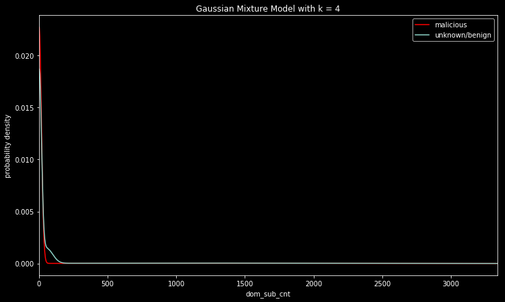
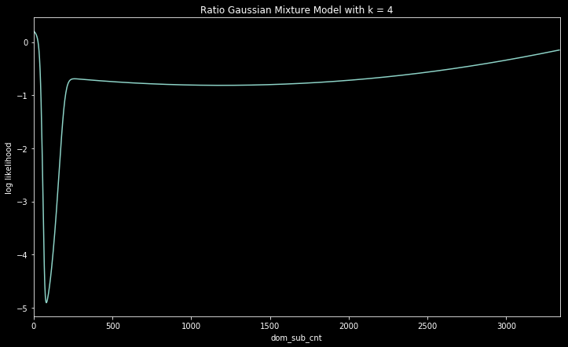
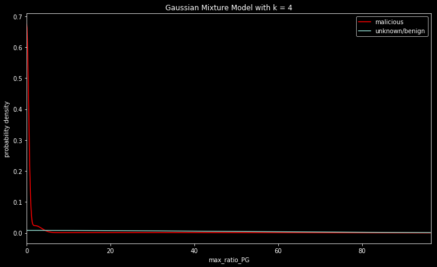
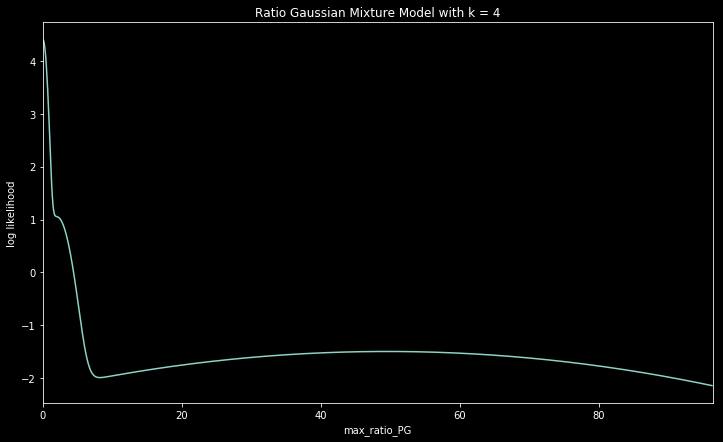

# Globally Adaptive Buckets

## A framework for sharing buckets with each organization contributing to the enhancement of the bucket quality

Think of a tree split as separating the data 
using feature-value ranges where there is
relatively high probability (purity) of
maliciousness.

Changing the threshold value results in
Different numbers of splits.

Use a Gaussian Mixture Model (GMM)
to approximate the distribution.

$`N_i = w_i e^{-ai(x-μ_i)^2}`$

$`N_i`$  is the $`i`$th Gaussian component

$`w_i`$  is the weight of the $`i`$th component

$`a_i`$ is the width parameter

$`μ_i`$ is the mean

The approximate pdf is

$`\text{GMM} = ∑_i N_i`$

For a specified threshold, splits are
set using the GMM curve.

### Globally Adaptive Buckets

<ul>
1) Use the Global GMM as the prior
distribution for future bucket-finding

2) Compute new-data GMM

3) Update Global GMM

4) Find buckets
</ul>

PDFs | Log Likelihood
-- | -- 
 | 
*dom_sub_cnt* | *Log Likelihood dom_sub_cnt*
 | 
*dom_sub_cnt* | *Log Likelihood dom_sub_cnt*