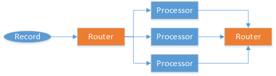

# Overview

CLAP Routing

# Processor Flow in the Standard DAG Model
Before covering routing, it is important to understand how data flows through the core DAG itself.

The standard DAG model is broken into several areas as described in 
[StandardDAGModel](StandardDAGModel.md). Each processsing area will receive data of one or more entity_types depending on routing (discussed later in this document). Further, each processing area has a defined preferential flow type which is either parallel or serial.

## Parallel Flow
Parallel flow means that for any number of processors which handle an entity-type, they all run independently of each other and generate independent results.



In parallel flows, there is no notion of connectivity between the processors, and the processors may indeed each be terminal. It is important however that each processor still forward any relevant results to enable tracking or persistence depending upon how the environment is modeled.

## Serial Flow
Serial flow means that for any number of processors which handle an entity-type, they all run consecutively and flow to the next processor with a single final result forwarded from the flow.


In serial flows, there is no notion or guarantee of order between processors, but the output forwarded from on processor flows to the input of the next until finally terminating. This is used to ensure records are handled in a consistent manner with a "built up" result.
An example of serial flow is enrichment, in which a record is enriched sequentially with any number of features, finally emerging as a single "wide record".

## Processing areas and their standard flow models
**Normalization**: 
*N/A*, each source in normalization is treated independently and is muxed together in the DAG. Details about sources is treated separately in the [Sourcing](Sourcing.md) document.

**Feature Calculation**:
*Parallel*, *Terminal*, calculation of features is treated as independent with no expectation of continuation of the flow. Features, when persisted, should be forwarded to any listening down-stream processors (generally for tracing).

**Enrichment**:
*Serial*, *Non-Terminal*, the enrichment of records must be serial to ensure each record is enriched with each feature applicable to that record type. There is a single feature type enriched by an enrichment processor and therefore to get a "fully enriched" record for analytics, enrichment must be serial.

**Analytics.Label Enrichment**:
*Serial*, *Non-Terminal*, the label enrichment of records must be serial to ensure each record is enriched with each score type applicable to that record type. There is a single score type enriched by a label enrichment processor and therefore to get a "fully enriched" record for analytics, enrichment must be serial.

**Analytics.Training**:
*Parallel*, *Non-Terminal*, training of an analytic model or calculation of "model-like" data (such as histograms) is entity-type specific and is considered independent of all other activities. Some analytics may be "training-only", in which the training processor no need for a separate prediction processor except to enable routing to Events. Training output (model states) should be forwarded to any listening down-stream processors (generally for tracing).

**Analytics.Prediction**:
*Serial*, *Non-Terminal*, the prediction of records must be serial to ensure each record is appended with the prediction result of each prediction processor applicable to that record type. There is a single event triggered by the completion of all predictions to ensure that post-analytics event processing is correlated, prediction must be serial.

**Event Processing**:
*N/A*, each event record is treated independently and is handled according to the rules of an event handler. More details are provided in the [Eventing](Eventing.md) document.

# Routing in the Standard DAG Model

Data is routed through the CLAP DAG based upon the source entity_type_id.
The entity_type_id identifies the log data type tha a single entry represents.

## Routing Forms
The standard model is expected to support 2 primary forms of routing, of which an implementer will likely support only a single form. It is entirely possible for an implementer to support either or both forms of routing.

The 2 forms are simple and labelled.

### Simple Routing Model
The simple routing model is the "default" model implemented in the reference codebase.  Simple routing allows each registered processor to participate in a single route, based upon the entity_type_id of data.

In this model, a processor is added to the DAG with the entity_type_id of data that will flow to the processor. For example the code to add a processor to the DAG might look like this:

``` myDag.FeatureCalculation.Add(myProcessor, HttpFeatureSpaces.HttpLog) ```

In the example above, the myProcessor component will receive all HttpLog records that flow through the DAG. 

Additionally, this model supports the "all" route which flows all data, regardless of type through this route. Notice that any data entries can flow through 2 routes in this model -- "all" and a type-specific route.

### Labelled Routing Model
The labelled routing model is an extension of routing in which named routes are created, which can have as members other routes and/or entity-types. In this manner, a route can permit the flow of multiple entity-types in any combination including allowing a single entity-type to flow through multiple routes. For example:

``` 
  Route httpRoute = new Route(HttpFeatureSpaces.HttpLog);
  Route connRoute = new Route(ConnFeatureSpaces.ConnLog);
  Route dnsRoute = new Route(DnsFeatureSpaces.DnsLog);
  Route http_conn = new Route(httpRoute, connRoute);
  Route dns_conn = new Route(dnsRoute, connRoute);

  myDag.Routes.Add(httpRoute, connRoute, dnsRoute, http_conn, dns_conn);
  myDag.Analytics.Prediction.Add(myProcessor, http_conn);
```

In the example above, the myProcessor component will receive all HttpLog and ConnLog records that flow through the DAG.

Note that the notion of "labelled" routes is that each of the routes above can be uniquely named in the DAG and the routes can be referenced by name rather than by object reference. This is a "TODO" item to have named routes and utility methods for dealing with routes by name.